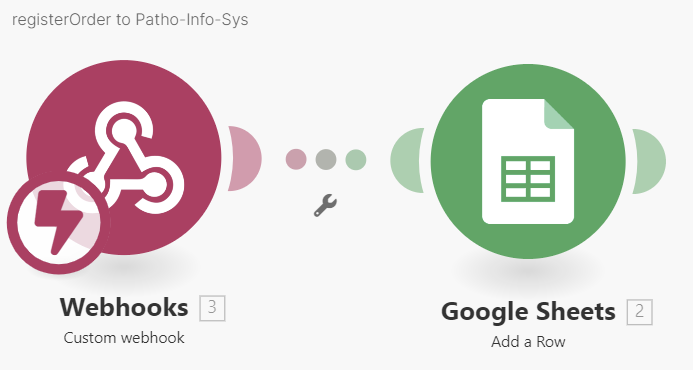
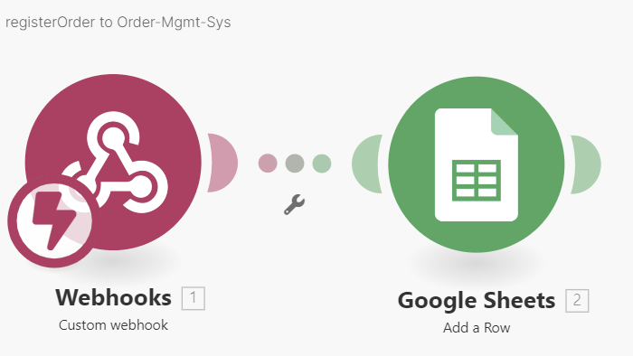
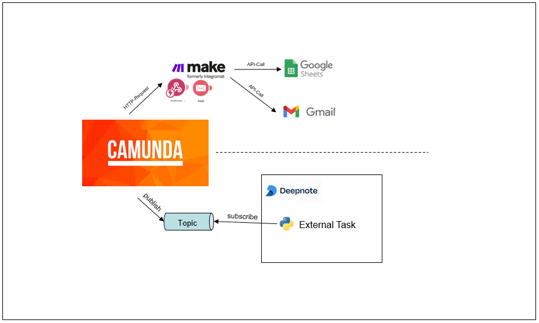

# Team-Moevenpick 🍨

## Abstract Project Description

In an initiative to enhance the workflow at the University Hospital Zurich's (USZ) Molecular Tumor Profiling (MTP) Laboratory, our project focused on digitalizing and streamlining key processes. We tackled the challenges posed by the reliance on multiple, isolated information systems and the extensive manual labor required in the "Order to Report" process layed out by the USZ. By integrating Camunda's workflow engine, we optimized the preanalytical stages, reducing manual tasks and improving data consistency. This was augmented by incorporating tools like Make.com for automated data processing and client communication, and Deepnote for executing Python scripts for specialized tasks. Our efforts culminated in a more efficient, precise, and responsive workflow, setting a blueprint for further optimizing laboratory processes and enhancing client communication, particularly in cases of interrupted DNA analyses. This project demonstrates the potential of digitalization and system integration in transforming complex healthcare workflows.

---

## Team-Members

| Name            | Email                            |
| --------------- | -------------------------------- |
| Sascha Frossard | sascha.frossard@students.fhnw.ch |
| Selina Hodel    | selina.hodel@students.fhnw.ch    |
| Denis Moser     | denis.moser@students.fhnw.ch     |
| Marvin Marqua   | marvin.marqua@students.fhnw.ch   |

**Coaches:**

- Andreas Martin
- Charuta Panda

## Running workflow instance

<https://digibp.herokuapp.com/camunda/app/cockpit/default/> with Tennant ID _moevenpick_ the workflow name is _Process_to_be_final_.

## Deployment

If you want to deploy the process you **need to add** the Camunda Form "02_Forms/CheckSampleForm.form" as additional file! Otherwise the process will not recognize the connection between the process and the formular.

---

## Introduction

#### Background

In this project, we confront the challenge of enhancing real-life processes within the Molecular Tumor Profiling (MTP) Laboratory at the University Hospital Zurich (USZ), a central unit in the Pathology Department. The MTP Laboratory plays a crucial role in genetic sequencing analysis, processing various sample types such as formalin-fixed paraffin-embedded (FFPE) blocks, extracted DNA/RNA, blood, and bone marrow samples. In collaboration with other departments at USZ and an external evaluation site, the MTP Laboratory provides essential genetic analysis services, significantly contributing to diagnostics and research. With the advancement of DNA sequencing and complex diagnostic techniques, a deeper understanding of cancer is now more attainable. A well-structured process, from order intake to report delivery, is vital to support physicians and researchers in their work. The University Hospital Zurich, a leader in these diagnostic procedures, has established an "Order to Report" process essential for creating medical reports based on initial orders and subsequent DNA sequencing. We take the "Order to Report" process as the starting point for our project.

##### Goals

Our project aims to enhance collaboration and data exchange across different stages of the laboratory workflow, striving for a more integrated and responsive system. The goals are:

1. To automate process steps that currently involve significant "manual labor".
2. To eliminate existing "dead ends" in the current processes to improve process quality.

#### Procedure

**The following steps were undertaken in this project:**

1. Review of the existing USZ "Order to Report" process in consultation with one project member who is working at USZ.

2. Create an AS-IS process model and identify challenges and optimization opportunities.

3. Utilizing insights from the analysis to model a TO-BE process as a proposal for a more streamlined process.

4. Selecting a section of the TO-BE process and using the Camunda workflow to implement automation to address the identified challenges.

**The following tools were used:**

| Tools         | Description                                                                                                                                                                                                                                                                                                                                                                                                                             |
| :------------ | :-------------------------------------------------------------------------------------------------------------------------------------------------------------------------------------------------------------------------------------------------------------------------------------------------------------------------------------------------------------------------------------------------------------------------------------- |
| Camunda       | This serves as the core modeling tool and workflow engine. It manages the overall workflow, including orchestration, integration, and communication within the process. Camunda handles various functions, such as webhooks, RESTful APIs, and JavaScript. Additionally, it is responsible for managing external tasks in the workflow.                                                                                                 |
| Make          | An online automation platform, Make.com plays a major role in coordinating and processing data received from Camunda. The created make-szenarios act as a bridge, particularly between Camunda and Google Sheets, facilitating data transfer and handling the necessary formatting or data transformations. Make.com also automates the task of updating Google Sheets with new data and is utilized for automated email notifications. |
| Deepnote      | In this platform, the Python script for the external task worker is developed and executed. This script, specifically designed for the "Calculate Sample Result" task in Camunda, automates decision-making based on predefined criteria for each sample type. It enhances efficiency by automating the manual task of cross-checking a sample against a checklist to assess "Sample Quality" before starting genetic analysis.         |
| Google Sheets | Tables were used instead of a database for storing and organizing data. Each worksheet in Google Sheets represents/simulates a different database of an information system, such as the Pathology Information System, Laboratory Information System and Order Management System.                                                                                                                                                        |

#### Results and Conclusion

**Review of the existing situation**
Our review of the University Hospital Zurich's (USZ) "Order to Report" process revealed a significant reliance on multiple information systems and communication channels. The creation of an AS-IS process Model from this analysis provided a comprehensive view of the existing workflow, covering stages from order and sample registration to processing, analysis, external evaluation, and client reporting (no existing USZ process models were avaliable or used throughout this project). A notable aspect of this process was the presence of multiple branching points and its dependency on several isolated information systems.

**AS-IS & Key Challenges, Issues and Problems**
With the AS-IS process model, we were able to identify some key challenges, including the complexity of the workflow due to diverse departmental information systems, the substantial manual effort (User Tasks) required for maintaining data consistency, and if not done correctly could lead to hidden "dead ends" since some tasks are reliant on process data. We also discovered the absence of automated client notifications during intricate DNA analysis stages (preanalytical and analytical).

In response to these challenges, we identified the need for a more streamlined workflow. We concluded that digitalization could substantially enhance process efficiency by automating manual tasks and ensuring uniform data consistency across all systems. These enhancements aim to quicken the workflow, reduce manual entry errors, and improve overall efficiency. Additionally, given the critical nature of genetic analysis, we decided that an automated notification system for clients, in instances of interrupted analyses, could improve customer satisfaction with timely communication. Based on these insights, a TO-BE process model was developed.

**TO-BE & Implementation**
In this project, we focused on optimizing a specific segment of the TO-BE process model, particularly the preanalytical stages and client notification. Utilizing Camunda's workflow engine as the central orchestrating element, we effectively managed and controlled the workflow sequence. This was augmented by integrating HTTP connectors and external tasks, enabling the incorporation of external systems such as Make and a Python-based external task worker developed in Deepnote.

This integration streamlined data transfer and processing, thereby reducing reliance on manual tasks. Potential "dead ends" due to missing data necessary for continuation of certain tasks could also be minimized by improving data consistency throughout different information systems. Another critical improvement was the implementation of automated email notification through the integration between Camunda and Make. This setup enabled the automated generation and dispatch of emails, potentially enhancing client communication efficiency, especially by providing timely updates and status information on DNA analysis in cases where their orders are aborted. Overall, these advancements not only demonstrate that digitalization and integration can lead to a more efficient, precise, and responsive laboratory workflow but also establish a blueprint and a starting point for potential further optimization of laboratory processes in the MTP Lab at the USZ.

More details can be found in following sections:

---

## AS-IS Process

The AS-IS model outlines the 'Order to Report' process at USZ, encompassing preanalytical (e.g. ordering, logistics, preparation, registering), analytical (e.g. pre-analysis, DNA/RNA extraction, sequencing, analysis and validation of results), and postanalytical stages (e.g. reporting), with tasks distributed among various actors across different distinct departments or facilities in this setting.

### Process Model

The complex process is simplified through subtasks, with some roles and interactions represented in empty pools. This approach was chosen **to focus onto key activities in the MTP Lab** and essential inter-organizational message flows.


### Pools

These pools represent different participants or entities involved in the process:

**Pathology USZ** A unit responsible for receiving, preparing, and distributing samples to various lab facilities, including the MTP lab, during the preanalytical stages.

**MTP Labor USZ** The central processing unit accountable for genetic analysis.

**FMI (External Lab/Partner)** An external partner facility tasked with post-processing analysis data.

**Oncology** An internal client that sends samples and requests genetic analysis within USZ.

**External Customer** An external client that places orders for genetic analysis from outside USZ. Typically, a sample extraction kit is sent to them following the order announcement.

### Roles

**Patient Management** The patient management is responsible taking care of administrative task regarding lab work such as processing orders and checking the order contains all necessary information.

**Accessioning** The accessioning responsible is handling incoming samples including tasks such as registrate and check samples.

**Lab technician** The lab technician is doing the actual work in the lab by processing the samples.

**Bio informatics** Runs algorithms on the sequenced data from the lab.

**Clinical Operations** Responsible for correct creation of analytical reports that will be sent to the client.

### Process Description

The process start with an internal or external client sending a request for a diagnosis order by email to the mailbox of the lab.

#### Order processing

**Process Order** The order is viewed in the mail and processed and checked if the important information is available.

**Register Sample-Order** The sample order is registered in the central pathology system. Internal orders will execute a sample extraction process from the patient. With external orders the patient material is directly acquired by the client.

**Sent extraction kit** For external orders a special box is sent to the client where the patient material will be sent back to the lab.

**Receive sample** The process is on halt until the sample phyisically arrives at the lab.

**Register sample** The incoming sample is registered in the laboratory system and the status of the order is updated in the order management system.

**Check sample** The sample is checked against certain criteria. If the sample does not fullfil the criteria the order is aborted. If ok the sample enters the lab.

**Check order form** A formally correct form has to be sent by the client for a sample to be sequenced. E.g. all information has to be correct and includes a signature consent by patient and physician.

#### Lab process

**Start Pre-Analytics** The sample is prepared for the lab process, that highly depends on the type of the processed patient material.

**DNA/RNA Extraction** The DNA/RNA is extracted which will be used for further analysis. The lab process can halt here until the order form is validated.

**Sequencing** The rna/dna is sequenced.

#### Post lab processing

**Sent sequencing data** The sequenced data is sent to external partner for generating a report.

**Finalize report** The report from the external partner is validated and finalized.

**Send report** The report is sent back to the client, that finishes the process.

#### Abort order

The abort order process can be triggered by multiple processes if e.g. the order form is uncomplete or missing for too long. Or if the sample fails in the lab process.

### Identified Challenges, Issues and Problems

The AS-IS process is characterized by its complexity and distribution across various participants in different locations, each utilizing different information systems. The primary challenge in this setup is ensuring data consistency, leading to issues, problems, and opportunities to achieve our goals:

- The order is digitally processed in different systems. The user has to use different systems and even copy certain data from one system to another by hand. A workflow management system could be used to centralize the workflow implementation and provide a single user interface to do the work.

- Updating the order status has to be done by hand and needs to be automatized. This includes cancelling or aborting a order.

---

## TO-BE Process

This chapter provides the optimized process with the related benefits and improvments.

### Process Description

The TO-BE Process improves the steps from _Order processing_ as described in the AS-IS Process. To ensure a certain quality of the developed to-be process as well as under the consideration of the available project time we decided to focus only on the above mentioned, _Order processing_ process part. We therefore took the steps from pre-analytics till report generation out of scope.

The developed to-be process will end before the analytics steps as it is a cut-out of the complete "Order to Report" process. It should reduce the complexity as well as gain a better overview for the reading user. All of the new developed steps will be described further in the following sections.

#### Process incoming order

The Process starts with revieving an order for genetic analysis.

**Order received** In this start event the clients announcement of an order for genetic analysis is recieved via email by the user in the Patientemanagement-role in the MTP Lab.

**Process Order** In this user task the user checks the order for important informations. Here we used a camunda generated task form, where the user can assign the orderId, sampleId, the customerEmail, and orderInternal (which contains the information if the order is internal or external).

**Register Sample Order** Here are two service tasks, which send data automatically to the the informations systems involved (Pathology and Ordermanagement System). In this project JavaScript formats the data payload for a POST API call, executed through an HTTP connector. This call triggers a make.com scenario via a webhook, automating the addition of this data into a Google Sheet which simulates the database of the Pathology and Ordermanagment System.

_Details: "Register Sample Order" to Pathology System:_

- Payload:

```JSON
out = JSON.stringify(
{
    "orderId": orderId,
    "sampleId": sampleId,
    "orderInternal": orderInternal
}
);
```

- Make scenario, triggered by a webhook, automatically adds a row containing the received data:
  

_Details: "Register Sample Order" to Ordermanagement System:_

- Payload: Here "order received" indicates the status of the order.

```JSON
status = "order received"
out = JSON.stringify(
{
    "orderId": orderId,
    "sampleId" : sampleId,
    "orderInternal": orderInternal,
    "orderStatus" : status
}
);
```

- Make scenario, triggered by a webhook, automatically adds a row containing the received data:
  

#### Process incoming sample

After the sample is ordered, the process waits until the sample physically arrives:

- **Receive Sample** The process has a interrupting timer boundary event that fires after 30days going to the **Abort Order** processing. The user can check the incoming sample and continue the process.
- **Register Sample** The user enteres additional data belonging to the sample.
- **Save Data** The service task enters the sample information in the LIMS, where it will be used in laboratory processing.
- **Update order status** The service task updates the status of the order to _Sample Received_ in the Order Management System.

If both updates where successful then the process continues.

#### Check Sample and Calculate Result

After the sample is successfully registered it needs to be checked against certrain quality or SOP criteria, as they are provided by the Standard Operating Procedure (SOP). After the sample is checked by an employee the data will be send to the next step, the calculation of the final sample result.

**Check Sample:**  
This process steps gets the SampleType as input variable. The value can differ between "DNA", "Bone marrow" and "FFPE". The value is passed to a certain Camunda-Form which uses it, to hide certain fields. Therefore we used FEEL Expressions inside the "hide" attribute of the elements.  
Example: `not(contains(field_0a4ef3i,\"bonemarrow\"))`

The dynamic formular is implemented because not all SampleTypes need to be checked against the same SOP criteria. Thats why the lab technican can only answer the, for the type needed questions. After all questions are answered and the submit button is pressed, the values gets passed to the next steps.

**Calculate Result:**  
As the previous step provides multiple answers we need to calculate one final result out of them. Therefore we implemented an external task in python which runs on deepnote. The external Task subscribes the specific topic and sends back one variable with the final value (ok/nok). The source code below shows the business logic which decides wether the sample is ok or not ok. As the fields are only initialized if the related SampleType is given, they can only be used after checking the SampelType value, otherwise the programm will fail as the fields will be "undefined".

```python
def calculate_sample_result_callback(self, taskid, response):
        #Get all variables from message JSON
        variables = response[0]['variables']
        data = variables
        #Save values from previous formular
        value_field_0u913tf_tumor_content = data['field_0u913tf_tumor_content']['value']
        value_SampleType = data['sampleType']['value']
        #Check if sampleType is FFPE, BONEMARROW, DNA and save related values which are created and send dynamically       
        if value_SampleType == 'ffpe':
            value_field_1wbwwxu_ffpe_tubes = data['field_1wbwwxu_ffpe_tubes']['value']
            value_field_1pjgpqw_ffpe_slices = data['field_1pjgpqw_ffpe_slices']['value']
            if value_field_1wbwwxu_ffpe_tubes and value_field_0u913tf_tumor_content == 'true' and value_field_1pjgpqw_ffpe_slices:       
                result = True           
            else:               
                result = False
        elif value_SampleType == 'bonemarrow':
            value_field_0zz95a6_bone_time = data['field_0zz95a6_bone_time']['value']
            value_field_1jaxerq_bone_volume = data['field_1jaxerq_bone_volume']['value']
            if value_field_0zz95a6_bone_time and value_field_0u913tf_tumor_content == 'true' and value_field_1jaxerq_bone_volume:   
                result = True           
            else:               
                result = False       
        elif value_SampleType == 'dna':           
            value_field_1crldde_dna_time = data['field_1crldde_dna_time']['value']           
            value_field_152dkxm_dna_yield = data['field_152dkxm_dna_yield']['value']           
            value_field_1unglw5_dna_volume = data['field_1unglw5_dna_volume']['value']           
            if value_field_1crldde_dna_time and value_field_0u913tf_tumor_content == 'true' and value_field_152dkxm_dna_yield and value_field_1unglw5_dna_volume:
                result = True           
            else:               
                result = False       
        else:           
            result = False               

        #Create variable sampleAcceptanceOk and assign the result as value       
        variables = {"sampleAcceptanceOk": result}       
        self.worker.complete(taskid, **variables)
```

#### Abort Order

Throughout the course of the procedure, there are various instances where an order may need to be aborted. These include:

- Incomplete order forms due to missing data.
- Failure to meet the criteria for sample acceptance.
- Non-receipt of a sample for more than 30 days after the order is placed.

If a reason to abort the order occurs, the process transitions to the user task 'approve order abort.' The lab's head assesses the validity of the abortion and adjusts the automatically passed failure reason if necessary. Once the validation is complete, the order abortion is automatically recorded in the system, and the client is promptly notified through an automatically generated email. Subsequently, the entire process is terminated.

### Process Model


### Architecture

With the digitalization of the to-be process are different systems connected to the orchestrator, Camunda. The exact architecture of the system can be found below.



### Process variables

| Variable           | Description                             | Data Type |                       |
| ------------------ | --------------------------------------- | --------- | --------------------- |
| orderId            | unique order id                         | string    |                       |
| orderInternal      | true if order is internal               | boolean   |                       |
| sampleId           | unique sample id                        | string    |                       |
| sampleType         | Type of the received sample             | string    | ffpe, dna, bonemarrow |
| orderFromComplete  | True if order form is complete          | boolean   |                       |
| sampleAcceptanceOk | true if sample acceptance is fullfilled | boolean   |                       |
| customerEmail      | email of the ordering client            | string    |                       |
| failureReason      | reason why order failed                 | string    |                       |

### Services

| Service            | Parameters                                                                 | url                                                                                                                                                                                                                                                 |
| ------------------ | -------------------------------------------------------------------------- | --------------------------------------------------------------------------------------------------------------------------------------------------------------------------------------------------------------------------------------------------- |
| registerSample     | sampleId, sampleType                                                       | <https://hook.eu2.make.com/ycuwr6q9br1a17isbfccp6kpsvvcg3fd>                                                                                                                                                                                        |
| updateOrderStatus  | orderId, orderStatus                                                       | <https://hook.eu2.make.com/swvbhj5qjw62gad48ivy6r5704n55662>                                                                                                                                                                                        |
| abort order        | orderId, sampleId, customerEmail                                           | <https://hook.eu2.make.com/7znnj319uhp4a1xuryaunn87gla72dcf>                                                                                                                                                                                        |
| notify customer    | orderId, sampleId, customerEmail,<br>orderFromComplete, sampleAcceptanceOk | <https://hook.eu2.make.com/kvpu9ync60hgj1b46ycwzq00rpc0n4ge>                                                                                                                                                                                        |
| registerOrderToPIS | sampleId, orderId                                                          | <https://hook.eu2.make.com/ido2q831oxvbl0pwq4njjbyloh8rneuu>                                                                                                                                                                                        |
| registerOrderToOMS | sampleId, orderId, orderStatus, orderInternal                              | <https://hook.eu2.make.com/4s0vhghjtmba9gshrsm2nk4mznu40yeq>                                                                                                                                                                                        |
| checkSample        | sampleType, formfields, sampleAcceptanceOk                                 | <https://deepnote.com/workspace/digbp-33286cab-ee00-4c9f-a201-adadf03e74e9/project/DigiBIP-Moevenpick-External-Task-13a3d82c-c958-4b10-bb5d-322eec9658e4/notebook/Service%20Integration%20using%20External%20Task-4993c5c6b67645c1b0a57cfbeb0461bc> |

### Benefits and Improvements

- Now all SOP criterias are considered for the sample check. Before it was only one value (OK/NOK) which could be processed.

## Conclusion
